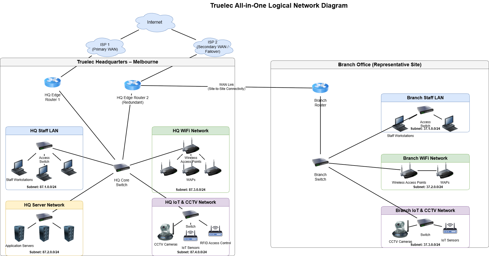

# Network Design
This section gives the detailed network design.

[Assumptions](#assumptions) | [Network Design Diagrams and Justifications](#network-design-diagrams-and-justifications) | [WiFi Design](#wifi-design) | [Address Allocations](#address-allocations) | [Recommended Hardware](#recommended-hardware) | [Plan](./plan.md) | [Cloud Services](./cloud.md) | [Security](./security.md) | [Ethics](./ethics.md) | [Reflection](./reflection.md) | [Return to index](./README.md)

---

## Assumptions

The project scenario does not provide all technical details required to design a complete and realistic network. The following assumptions have therefore been made. These assumptions are reasonable, limited, and directly influence the proposed network design.

1. **Headquarters location**  
   The Truelec headquarters is assumed to be located in **Melbourne, Australia**, in accordance with the scenario instructions. This assumption provides a realistic basis for WAN connectivity, network scale, and infrastructure design.

2. **Branch office locations**  
   Truelec is assumed to operate branch offices in **Brisbane, Perth, Adelaide, and Hobart**. The detailed network design is presented for **one representative branch office**, with the same design principles assumed to apply to all other branches.

3. **Number of staff at headquarters**  
   The headquarters is assumed to have **65 staff members**, including management, consultants, marketing staff, and ICT personnel. This assumption is used to determine network capacity, WiFi coverage, and equipment sizing.

4. **Number of staff at branch office**  
   The representative branch office is assumed to have **20 staff members**, including electricians, engineers, and support staff. This assumption informs branch network capacity and IP address allocation.

These assumptions are applied consistently throughout the network topology, IP addressing scheme, WiFi design, and hardware recommendations.

---

## Network Design Diagrams and Justifications

The proposed network is designed using a **centralised hub-and-spoke topology**, where the headquarters acts as the central hub and branch offices connect via WAN links. This design simplifies management, centralises services, and supports consistent security enforcement across the organisation.

To meet the requirement for high availability, the headquarters network includes **redundant WAN connections and edge routers**. Two Internet Service Providers connect to separate HQ edge routers, ensuring continued connectivity in the event of a link or device failure.

Logical network segmentation is implemented to separate staff devices, servers, wireless access, and IoT systems. This improves performance, simplifies troubleshooting, and reduces security risks by limiting unnecessary access between different device categories.

### Logical Network Diagram

The diagram below shows the complete logical network design for Truelec, including the headquarters and one representative branch office.

The source file for this diagram is available in the repository:  
- `./diagrams/logical-network.drawio`

---

## WiFi Design

An enterprise-grade WiFi network is deployed at the headquarters to support a high density of wireless devices while maintaining performance and security.

- **Wireless standard:** IEEE 802.11ax (WiFi 6)  
- **Frequency bands:**  
  - 5 GHz is used as the primary band to provide higher throughput and reduced interference  
  - 2.4 GHz is enabled to support legacy devices  

- **Access point deployment:**  
  Four wireless access points are installed and evenly distributed across the office to ensure full coverage, redundancy, and support for multiple concurrent devices per user.

- **Channel configuration:**  
  - Non-overlapping channels are used on the 5 GHz band  
  - Channels 1, 6, and 11 are used on the 2.4 GHz band  

- **Security configuration:**  
  - WPA3-Enterprise authentication is used for strong encryption and user authentication  
  - Wireless clients are isolated within a dedicated WiFi subnet to limit exposure to critical systems  

This WiFi design provides reliable coverage, strong security, and scalability to support future growth.

---

## Address Allocations

A structured IPv4 addressing scheme is implemented using only `/24` and `/16` network masks, as required by the project specification. The first octet of each address is derived from the group members’ student IDs, and no private IP ranges are used.

### Headquarters Address Allocation (87.0.0.0/16)

| Network Segment | Purpose | Subnet |
|----------------|---------|--------|
| HQ Staff LAN | Wired staff workstations | 87.1.0.0/24 |
| HQ Server Network | Application and internal servers | 87.2.0.0/24 |
| HQ WiFi Network | Wireless staff access | 87.3.0.0/24 |
| HQ IoT & CCTV Network | CCTV, IoT sensors, RFID systems | 87.4.0.0/24 |

### Branch Office Address Allocation (37.0.0.0/16)

| Network Segment | Purpose | Subnet |
|----------------|---------|--------|
| Branch Staff LAN | Wired staff devices | 37.1.0.0/24 |
| Branch WiFi Network | Wireless access | 37.2.0.0/24 |
| Branch IoT & CCTV Network | Security and IoT devices | 37.3.0.0/24 |

This addressing scheme is clear, scalable, and consistent across all sites.

---

## Recommended Hardware

The following enterprise-grade network equipment is recommended to support the proposed design. The equipment is selected based on reliability, performance, scalability, and suitability for a multi-site organisation.

| Device Type | Manufacturer | Model | Key Specifications | Quantity | Approx. Cost (AUD) |
|------------|--------------|-------|--------------------|----------|--------------------|
| Edge Router | Cisco | ISR 4331 | Gigabit WAN, enterprise security features | 2 | $3,200 each |
| Core Switch | Cisco | Catalyst 2960-X | 48× Gigabit ports, managed switching | 1 | $4,000 |
| Access Switch | Cisco | Catalyst 2960-L | 24× Gigabit ports | 2 | $2,200 each |
| Wireless Access Point | Cisco | Aironet 1832i | 802.11ax, dual-band, PoE | 4 | $1,200 each |
| Application Server | Dell | PowerEdge T350 | Xeon CPU, 32 GB RAM, RAID storage | 3 | $3,500 each |
| Branch Router | Cisco | ISR 4321 | Gigabit WAN, VPN support | 1 | $2,500 |

Enterprise-grade routers and switches ensure reliability and support WAN redundancy. Managed switches enable clear traffic separation, while modern wireless access points support high device density. Dedicated servers provide reliable hosting for internal systems.

---
