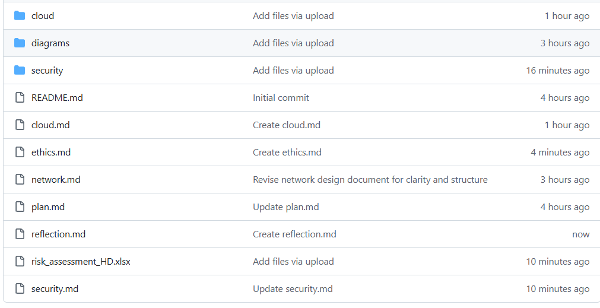

# Project Reflection
This section reflects on the success and challenges in the project and with teamwork.

[GitHub Commits](#github-commits) | [List of Tasks](#list-of-tasks) | [Reflection on Commits and Tasks](#reflection-on-commits-and-tasks) | [Reflection on Group Work](#reflection-on-group-work) | [Plan](./plan.md) | [Network Design](./network.md) | [Cloud Services](./cloud.md) | [Security](./security.md) | [Ethics](./ethics.md) | [Return to index](./README.md)

---

## GitHub Commits

A screenshot showing the GitHub commit history of **all group members** is included below. The commit history demonstrates regular and distributed contributions across multiple weeks of the term, rather than commits being concentrated only near submission deadlines.

The commit frequency tool on GitHub was used to review contribution patterns and confirm consistent participation by both students throughout the project duration.

---

## List of Tasks

This project was completed by a group of two students:

- **Tejo Priyanka Modugumudi (12316187)**
- **Yashwanth Bellam (12311837)**

The actual contribution of tasks is summarised below:

| Student | Contributions |
|--------|---------------|
| Tejo Priyanka Modugumudi | Led the network design and diagram creation; contributed to IP addressing and WiFi design; completed the ethical and social issues section; reviewed security and cloud sections. |
| Yashwanth Bellam | Led the cloud services analysis and pricing comparison; contributed to the risk assessment spreadsheet; assisted with security controls and reviewed network documentation. |

Although each student led specific areas, both members reviewed each other’s work to ensure accuracy, consistency, and alignment with the marking rubric.

---

## Reflection on Commits and Tasks

GitHub was used consistently as the primary collaboration and version control tool. Commits were made across **multiple weeks of the term**, including planning, design, analysis, and final review stages.

The number of commits made by each student broadly reflects the tasks performed. Some variation in commit counts occurred due to the nature of work; for example, creating network diagrams or spreadsheets typically resulted in fewer but larger commits, whereas written analysis produced more frequent incremental commits.

Overall, the commit history accurately represents the contribution of each student and demonstrates sustained engagement rather than last-minute work. The frequency and distribution of commits across weeks were sufficient and appropriate for a project of this scope.

---

## Reflection on Group Work

The group worked collaboratively using **Microsoft Teams** for scheduled meetings and **WhatsApp** for quick communication and coordination. Meetings were held at least twice per week to review progress, resolve issues, and allocate upcoming tasks.

One challenge encountered was coordinating work across different technical components, such as network design, cloud pricing tools, and security risk assessment templates. These challenges were managed by breaking tasks into smaller steps and clarifying expectations during meetings.

Several techniques proved effective and would be recommended for future group projects:
- **Early task allocation:** Clearly assigning responsibilities reduced duplication of effort.
- **Regular progress check-ins:** Frequent meetings helped identify issues early.
- **Consistent GitHub usage:** Regular commits reduced the risk of lost work and improved transparency.
- **Rubric-driven reviews:** Referring to the marking rubric throughout the project ensured appropriate depth and focus.

These techniques helped maintain professional collaboration and would be beneficial in future academic and industry-based group projects.

---

## Conclusion

Overall, the group worked effectively and professionally to complete the project. Clear communication, structured planning, regular GitHub contributions, and mutual review of work contributed to a successful outcome. The experience provided valuable insight into collaborative technical projects and highlighted practical strategies for improving teamwork in future projects.
