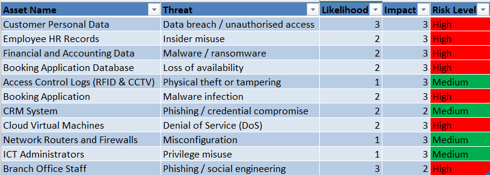
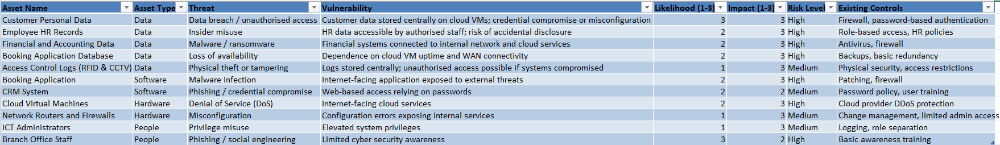

# Security

This section presents a mini cyber security risk assessment for the proposed Truelec network and recommends appropriate security controls to mitigate the highest identified risks.

[Risk Assessment](#risk-assessment) | [Security Controls](#recommended-security-controls) | [Network Design](./network.md) | [Cloud Services](./cloud.md) | [Ethics](./ethics.md) | [Reflection](./reflection.md) | [Return to index](./README.md)

---

## Risk Assessment

A mini cyber security risk assessment was conducted using the risk assessment template provided in the unit. Due to limited organisational detail, a subset of a full risk assessment process was applied, focusing on identifying key assets, threats, vulnerabilities, and associated risks relevant to the proposed network and cloud-based infrastructure.

### Methodology

The assessment considered:
- **Asset identification** across all asset types (data, software, hardware, and people)
- **Threat identification** using common information security threat categories
- **Vulnerability identification** based on the project scenario and proposed design
- **Risk evaluation** using a qualitative scale:
  - Likelihood: 1 (Low) to 3 (High)
  - Impact: 1 (Low) to 3 (High)
- **Risk level determination** (Low, Medium, High)

The completed risk register is provided as an Excel spreadsheet in the project repository.

### Assets and Threat Coverage

The risk assessment includes:
- **Data assets (5):**
  - Customer Personal Data
  - Employee HR Records
  - Financial and Accounting Data
  - Booking Application Database
  - Access Control Logs (RFID & CCTV)
- **Software assets:** Booking Application, CRM System
- **Hardware assets:** Cloud Virtual Machines, Network Routers and Firewalls
- **People assets:** ICT Administrators, Branch Office Staff

The assessment covers **more than eight information security threats**, including data breaches, malware and ransomware, phishing and social engineering, denial of service, misconfiguration, insider misuse, privilege abuse, physical theft, and loss of availability.

### Risk Assessment Results

The **TVA Matrix Summary** identifies multiple high-risk items. Among these, **Customer Personal Data** is rated as the **highest-risk data asset**, with a **High risk level** resulting from:
- Likelihood: 3 (High)
- Impact: 3 (High)

Screenshots of the TVA Matrix Summary are provided below:

  

---

## Recommended Security Controls

Based on the risk assessment results, **Customer Personal Data** has been selected for targeted risk treatment due to its high likelihood of compromise and severe potential impact, including legal penalties, financial loss, and reputational damage.

Three security controls are recommended below, aligned with the unit content and **NIST SP 800-53**.

---

### Control 1: Strong Access Control and Multi-Factor Authentication (MFA)  
*(NIST SP 800-53: AC – Access Control, IA – Identification and Authentication)*

**Description**  
Access control ensures that only authorised users can access customer personal data. Multi-Factor Authentication (MFA) adds an additional verification step beyond passwords, such as a mobile authentication application or hardware token.

**Risk reduction**  
The primary threat to customer personal data is **unauthorised access caused by credential compromise or misconfiguration**. MFA significantly reduces the likelihood of successful attacks using stolen or weak credentials, while role-based access control limits insider misuse by restricting access to job-specific permissions.

**Implementation in the project scenario**  
- Enforce MFA on all cloud virtual machines hosting the booking application and customer databases.
- Restrict administrative access to authorised ICT administrators only.
- Apply role-based access for staff accessing customer data from headquarters and branch offices.
- Regularly review and revoke access for staff who change roles or leave the organisation.

This control directly applies to the **cloud servers**, **application servers**, and **user access paths** defined in the network design.

**User disadvantages**  
- Slightly longer login times.
- Training required for staff unfamiliar with MFA tools.
- Temporary access issues if authentication devices are unavailable.

---

### Control 2: Encryption of Data at Rest and in Transit  
*(NIST SP 800-53: SC – System and Communications Protection, CP – Cryptographic Protection)*

**Description**  
Encryption protects data by rendering it unreadable without authorised cryptographic keys. This applies to both stored data and data transmitted across networks.

**Risk reduction**  
Encryption reduces the **impact** of a data breach by ensuring that even if data is accessed without authorisation, it cannot be easily read or misused. This is critical for protecting customer personal data stored in cloud environments.

**Implementation in the project scenario**  
- Enable disk encryption on all cloud virtual machine storage containing customer data.
- Use HTTPS/TLS encryption for all web access to the booking application.
- Encrypt backups stored in cloud storage services.
- Apply encrypted connections for data transferred between headquarters and branch offices.

This control protects data across **WAN links**, **cloud infrastructure**, and **internal network connections** shown in the network design.

**User disadvantages**  
- Minor performance overhead due to encryption processes.
- Increased complexity in encryption key management.
- Additional configuration effort for ICT administrators.

---

### Control 3: Centralised Logging, Monitoring, and Incident Detection  
*(NIST SP 800-53: AU – Audit and Accountability, SI – System and Information Integrity)*

**Description**  
Centralised logging and monitoring involve collecting and analysing system logs to detect suspicious or malicious activity.

**Risk reduction**  
This control reduces both the **likelihood and duration** of successful attacks by enabling early detection of unauthorised access, abnormal login patterns, and potential data exfiltration. Early detection limits overall damage.

**Implementation in the project scenario**  
- Enable detailed access logging on cloud virtual machines and databases.
- Collect logs from routers, firewalls, and application servers into a central monitoring platform.
- Configure alerts for unusual access to customer personal data.
- Regularly review logs as part of incident response procedures.

This control directly relates to the **cloud services**, **network security devices**, and **core infrastructure** defined in the network design.

**User disadvantages**  
- Increased monitoring may raise staff privacy concerns.
- ICT staff must manage and analyse large volumes of log data.
- Potential additional costs for cloud-based monitoring tools.

---

### Summary

The combination of **strong access control with MFA**, **encryption**, and **centralised logging and monitoring** provides layered protection for customer personal data. These controls significantly reduce the likelihood of unauthorised access, minimise the impact of breaches, and improve incident detection and response. Although these controls introduce some usability and administrative overhead, they are justified given the high risk associated with customer personal data.

